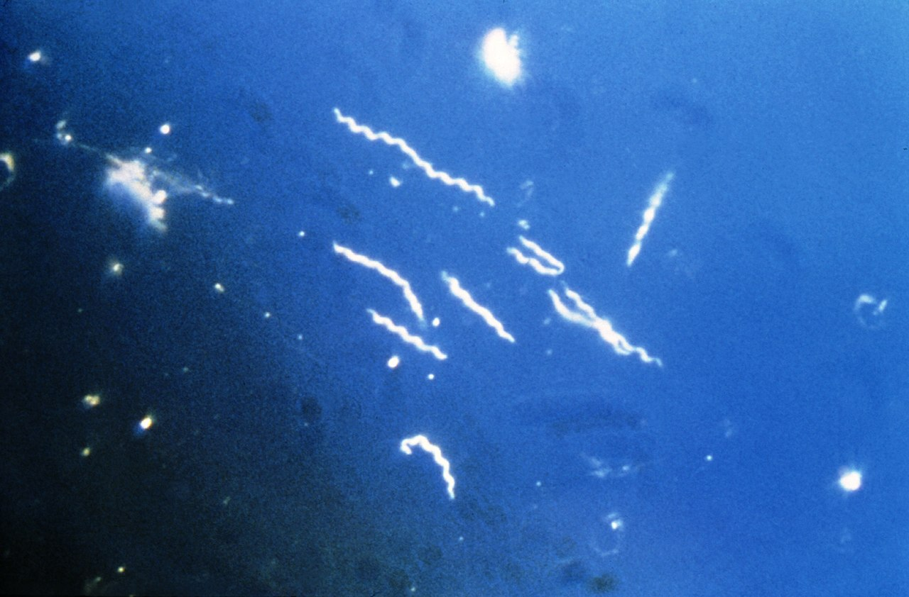

```{r setup, include=FALSE}
knitr::opts_chunk$set(echo = TRUE)
```

Jamie Chang 20264333, Aidan McLeod 20294254, Jade Goodman 20282975, Isabella Infusino 20218982, Autumn Hodgins 20270064

[GitHub](https://github.com/jamiechang03/Rentrez)

```{r message=FALSE, warning=FALSE}
library(BiocManager)
library(annotate)
library(Biostrings)
```

### Pt. 1

**Import Data**

```{r}
Sequences = read.csv("Sequences.csv")
```

------------------------------------------------------------------------

**Base Pair Counts**

```{r}
counts = data.frame()

for (i in 1:nrow(Sequences)){
    name = sub("^>?(\\S+).*", "\\1", Sequences$Name[i])
    A_num = 0
    C_num = 0
    T_num = 0
    G_num = 0
  seq = Sequences$Sequence[i]
  for (j in 1:nchar(seq)){
    nuc = substr(seq, j, j)
    if (nuc == "A"){
      A_num = A_num + 1
    } else if (nuc == "C"){
      C_num = C_num + 1
    } else if (nuc == "T"){
      T_num = T_num + 1
    } else {
      G_num = G_num + 1
    }
  }
  row = data.frame(Sequence_ID = name, A_count = A_num, C_count = C_num, T_count = T_num, G_count = G_num)
   counts = rbind(counts, row)
}
```

The counts are displayed in the final table below.

------------------------------------------------------------------------

**Sequences**

```{r}
for (i in 1:nrow(Sequences)){
  print(Sequences$Sequence[i])
}
```

------------------------------------------------------------------------

**Image & Link**

```{r, fig.cap="Figure 1. Borrelia burgdorferi, the bacterium responsible for Lyme disease."}

```

[Wikipedia](https://en.wikipedia.org/wiki/Borrelia_burgdorferi)

------------------------------------------------------------------------

**GC Content & Final Table**

```{r}
counts$GC_Content = with(counts, (G_count + C_count) / (A_count + C_count + T_count + G_count) * 100)

knitr::kable(counts)
```

------------------------------------------------------------------------

### Pt. 2

**BLAST**

```{r}
MySeq = "GCCTGATGGAGGGGGATAACTACTGGAAACGGTAGCTAATACCGCATGACCTCGCAAGAGCAAAGTGGGGGACCTTAGGGCCTCACGCCATCGGATGAACCCAGATGGGATTAGCTAGTAGGTGGGGTAATGGCTCACCTAGGCGACGATCCCTAGCTGGTCTGAGAGGATGACCAGCCACACTGGAACTGAGACACGGTCCAGACTCCTACGGGAGGCAGCAGTGGGGAATATTGCACAATGGGCGCAA"
```

```{r}
BlastDF = blastSequences(MySeq, as='data.frame', timeout=240)
```

```{r}
HitSeq = BlastDF$Hsp_qseq[1]
```

------------------------------------------------------------------------

**Alignment**

```{r}
print(nchar(MySeq))
print(nchar(HitSeq))
MySeq = gsub("\n", "", MySeq)
HitSeq = gsub("\n", "", HitSeq)

query = DNAString(MySeq)
subject = DNAString(HitSeq)

alignment = pairwiseAlignment(query, subject, substitutionMatrix = nucleotideSubstitutionMatrix())
alignment
```

The R code gives +1 alignment score for every match in the alignment, and will penalize for mismatches/gaps. Further, the length of both the query and subject sequences is 250. Therefore the alignment score of 250 indicates 250 matches, which tells us the sequences are identical.

------------------------------------------------------------------------

**Analysis**

Our subject sequence is the bacterium Yersinia pestis. The perfect alignment between the query and subject sequences indicate they are identical, so our query sequence is also Yersinia pestis.

This is problematic as Yersinia pestis is responsible for the plague^1^.

***

**References**

1. Achtman M, Zurth K, Morelli G, Torrea G, Guiyoule A, Carniel E. yersinia pestis, the cause of plague, is a recently emerged clone of yersinia pseudotuberculosis. Proceedings of the National Academy of Sciences. 1999;96(24):14043-14048. doi:10.1073/pnas.96.24.14043 